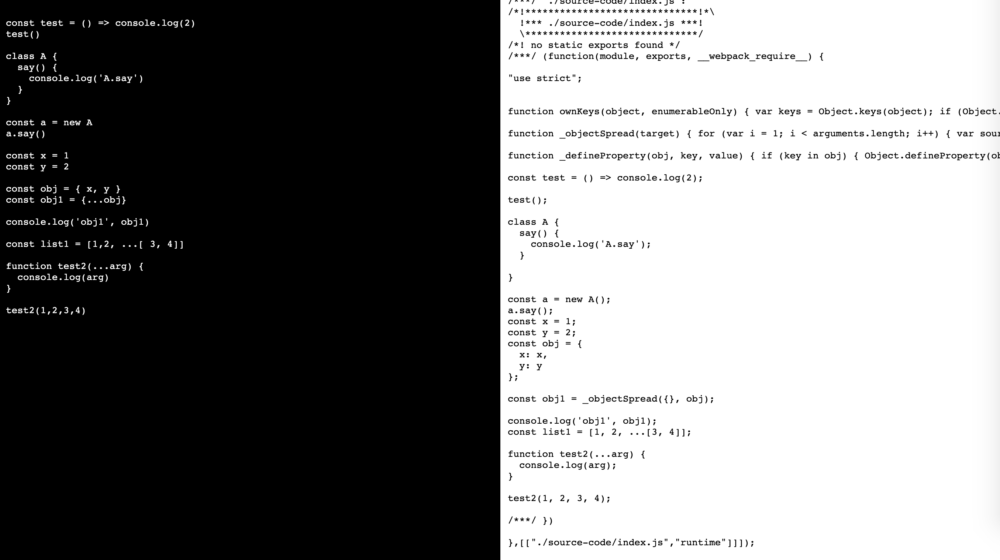

## 背景

之前在看《你不知道的JavaScript》的时，作者在`7.6`节提到**特性测试**

> 什么是特性测试?就是一种由你运行的用来判断一个特性是否可用的测试。 
>
> ....
>
> 但是如何测试涉及新语法的特性呢?
>
> 可能你会想到使用像下面这样的代码:
>
> ```javascript
>  try {
>     a = () => {};
>     ARROW_FUNCS_ENABLED = true;
> } catch (err) {
>     ARROW_FUNCS_ENABLED = false;
> }
> ```
>
> 不幸的是，这行不通，因为我们的 JavaScript 程序是需要编译的。所以，如果引擎还不支持ES6箭头函数的话，就会停在() => {}语法处。这样你程序中的一个语法错误会使其 无法运行，你的程序也就无法根据特性是否被支持而作出不同的反应。 
>
> ....
>
> 我们直接跳到使用 eval(..) 怎么样?
> 还没那么快，参见本系列《你不知道的 JavaScript(上卷)》第一部分，其中介绍了为什么 
>
> eval(..) 不是一个好主意。但是还有一种缺点少一些的选择:Function(..) 构造器。 考虑: 
>
> ```javascript
> try {
>     new Function( "( () => {} )" );
>     ARROW_FUNCS_ENABLED = true;
> } catch (err) {
>     ARROW_FUNCS_ENABLED = false;
> }
> ```
>
> 好吧，现在我们就是在通过元编程确定像箭头函数这样的特性是否能在当前引擎上编译。 

看到这里，我脑海中出现了一个想法：是否能利用特性测试获取浏览器的特性，并据此动态的打包js代码？

基于这个想法，有了下面这篇文章。


## 先看demo

首先，我们先看一下demo。效果截图（在chrome上，打包前后的代码对比）：



GitHub仓库：[js-build-by-feature-map-demo](https://github.com/ganshuai/js-build-by-feature-map-demo.git)

**运行**：

1. npm i
2. npm run demo
3. 更改source-code/index.js的代码
4. 然后在不同浏览器查看效果


## js-build-by-feature-map

*js-build-by-feature-map是为了实现根据浏览器特性动态构建前端js代码的工具，它依赖与webpack*

js-build-by-feature-map分为如下几个部分：

1. [js-feature-test](https://github.com/ganshuai/js-feature-test.git)：测试浏览器对js新特性的兼容
2. [js-build-by-feature-map](https://github.com/ganshuai/js-build-by-feature-map.git)：生成webpac config，并使用js-build-by-feature-map-loader打包js
3. [js-build-by-feature-map-loader](https://github.com/ganshuai/js-build-by-feature-map-loader.git)：利用babel以及babel-plugin转化js代码
4. [js-build-by-feature-map-express-service](https://github.com/ganshuai/js-build-by-feature-map-express-service.git)：利用js-feature-test、js-build-by-feature-map和express来提供根据浏览器特性来转化js代码的功能。可以极大的简化js-feature-test和js-build-by-feature-map的使用。
5. [js-build-by-feature-map-demo](https://github.com/ganshuai/js-build-by-feature-map-demo.git)：一个利用js-build-by-feature-map-express-service实现的demo，用来说明js-build-by-feature-express-service的使用方式和效果
6. [js-build-by-feature-map-template](https://github.com/ganshuai/js-build-by-feature-map-template.git)：一个使用js-build-by-feature-map-express-service的简单模版，使用此模版能快速的使用js-build-by-feature-map-express-service来提供动态编译服务


## 意义/作用

不知道大家有没有在产生一个想法：这个东西有什么意义和作用呢？

首先，做这个东西的初衷不是“需求”推动的。我之所以想做这个，只是为了做一种尝试。在做之前，我并没有考虑过它的意义和作用。

这当然不能说明它没有意义/作用。我个人认为它有如下作用：

1. 减小js打包大小（一定程度）
2. 提升js运行性能（一定程度和部分浏览器）
3. 更面向未来
4. 降级方案更合理
5. 更易于调试（一定程度）
6. 提高打包速度（一定程度）

当然，目前而言这些作用带来的提升都不明显。同时，目前要将**这种方式部署到生产环境还不成熟**。

不过，**在开发环境下我们还是可以尝试的**。


## 快速使用

*备注：js-build-by-feature-map-express-service依赖与webpack。目前不支持非webpack项目*

要想在开发服务中使用js-build-by-feature-map，最简单的方式是使用js-build-by-feature-map-template：

1. 做好除了js-build-by-feature-map以外的配置，确保工程能正确build代码

2. 拷贝js-build-by-feature-map-template中的service.js到工程根目录

3. 根据工程需要配置service.js中的config

4. 安装service.js中使用到的依赖

5. 在package.json中添加命令service: node service.js。或者直接运行node service.js


## 原理

*打包的原理非常简单：babel的每一种转化都是由一个单独的plugin来控制。我们根据浏览器特性生成babel的plugin数组，就可以生成兼容浏览器的js代码。*

然而，在这个根本的构建原理之上，仍然有一些运行流程需要我们知道。

以js-build-by-feature-map-express-service(简称service)来说明运行过程：

1. service依赖js-build-by-feature-map、js-feature-test和express
2. js-build-by-feature-map依赖js-build-by-feature-map-loader
3. service根据配置，使用express监听js请求和html请求
4. 当service.js接收到一个html请求以后，会判断请求头里面的referrer字段和cookie里是否带有jsFeatureMap。在满足referrer不是js-feature-test以及jsFeatureMap不存在的条件下，自动将请求转发到js-feature-test页面
5. js-feature-test页面会使用js-feature-test依赖里面的代码对浏览器的feature做测试，并将结果存放在cookie中。然后跳转回之前的页面
6. service.js重新接收到html请求并获取到cookie里面的jsFeatureMap，然后使用express的static返回html给浏览器
7. 浏览器解析html并发起js文件请求。
8. service接收到js文件请求并挂起所有js请求，然后调用js-build-by-feature-map根据featureMap对工程js代码做转化和打包。
9. js-build-by-feature-map会根据featureMap生成md5，利用md5 key对所有相同特性的请求做打包共享
10. 不同的featureMap拥有不同的打包状态和输出目录
11. 当打包完成以后，service将所有js请求利用express的static返回输出目录里面的js文件

*备注：目前，webpack的配置需要启用watch:true，否者同一个页面里面每一个js请求都会触发对工程的重新编译打包。同时，service调用配置必须启用isDifferentFile: true，将不同特性的js输出到不同目录，否者后面的打包会覆盖前面打包的输出文件。*


## 完善

目前而言，js-build-by-feature-map仅仅处于能使用的阶段。还有很多工作需要进一步晚上。如：

1. 特性测试的准确性验证和完善
2. 浏览器兼容性测试
3. 根据浏览器兼容性测试的结果动态生成polyfill
4. 外部依赖代码使用源代码
5. 优化打包速度
6. 优化打包资源占用
7. 文档
8. cookie的替代方案
9. 根据浏览器对css兼容动态处理css


*对于js-build-by-feature-map，我的目标是能将服务部署到生产环境。*